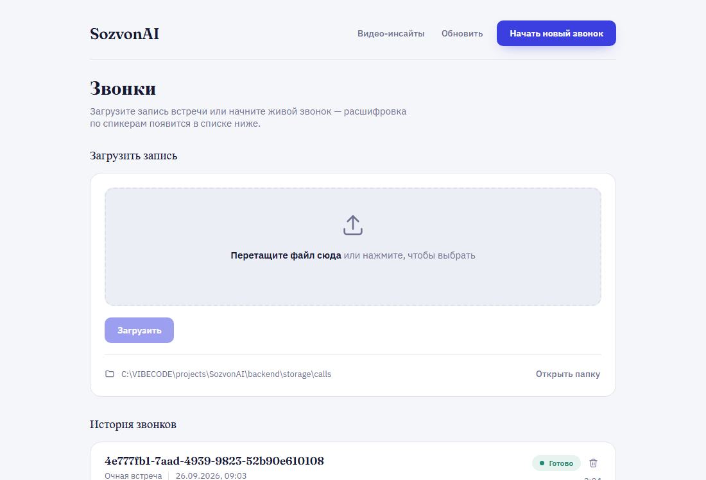

# SozvonAI

Сервис автоматической транскрибации деловых звонков и встреч — полностью локальный, без единого платного API. Загружаете запись или подключаете живой звонок — получаете текст, размеченный по спикерам, в реальном времени.



## Зачем это

Предпринимателю после переговоров нужен текст встречи, а не аудиофайл. Готовые SaaS-решения (Otter.ai, Fireflies и т.п.) гоняют запись через чужое облако — для приватных деловых разговоров это не всегда приемлемо. SozvonAI решает ту же задачу целиком на своём железе: распознавание речи, разметка по говорящим и суммаризация — всё локально, без отправки аудио куда-либо наружу.

## Что умеет

- **Batch-транскрибация** — загрузили файл (аудио или видео) → на выходе текст, размеченный по репликам и спикерам.
- **Живая транскрибация** — микрофон или захват вкладки браузера (онлайн-звонок), текст появляется на экране почти в реальном времени, посегментно.
- **Диаризация «кто говорил» — гибридная схема**: во время звонка — быстрая грубая кластеризация голосов (для отклика в реальном времени), сразу после звонка — фоновая точная пересборка через `pyannote.audio` и подмена черновой разметки на точную. Полноценная real-time-диаризация ненадёжна технически — это осознанный архитектурный компромисс между скоростью и точностью.
- **Экспорт** — .txt, .pdf (с корректно встроенной кириллицей) и сама аудиозапись.
- **Видео-инсайты** — отдельный раздел: ссылка на YouTube → расшифровка → отчёт по ключевым мыслям от локальной LLM (без диаризации, суммаризация публичного контента).
- Переименование спикеров, история звонков, удаление записей — обычный SaaS-минимум для того, чтобы продуктом можно было пользоваться, а не только демонстрировать пайплайн.

## Почему это не тривиально технически

- **ASR и диаризация работают на потребительской GPU с 4GB VRAM** (GTX 1650) — модели и параметры декодирования (`beam_size`, размер модели) подобраны так, чтобы уложиться в этот бюджет и не перегревать карту при почти непрерывной нагрузке во время живого звонка, с конфигурируемым откатом на CPU int8.
- **Живая диаризация — открытая исследовательская задача**, а не готовая библиотека «из коробки»: онлайн-кластеризация голосовых эмбеддингов с адаптивными порогами уверенности и взвешенным обновлением центроида спикера (короткая шумная реплика двигает профиль слабо, длинная — сильно) — понадобилось несколько итераций отладки на реальной речи, а не только на синтетике.
- **Реконсиляция черновой и точной разметки** — после звонка draft-метки живой диаризации сопоставляются с результатом offline `pyannote.audio` по таймкодам и подменяются на финальные, без потери прогресса пользователя.
- **Устойчивость к артефактам ASR** — Whisper на паузах и тихих участках иногда выдаёт не тишину, а заученные из обучающих данных фразы («Редактор субтитров...») — есть фильтрация подобных известных галлюцинаций.
- **Ничего не уходит в облако** — распознавание речи (`faster-whisper`), диаризация (`pyannote.audio`) и суммаризация видео (`Qwen2.5-3B`, GGUF) — три независимые ML-модели, всё выполняется локально.

## Архитектура (коротко)

```
Загрузка файла ──▶ ffmpeg ──▶ faster-whisper (GPU) ──▶ pyannote diarization (GPU) ──▶ SQLite
                                                                                          │
Живой звонок ──▶ VAD (silero-vad) ──▶ потоковый whisper ──▶ грубая live-диаризация ──▶ WebSocket ──▶ экран
                                                    │
                                                    └──▶ полный wav на диск ──▶ фоновая реконсиляция (pyannote) после звонка
```

Полное обоснование архитектурных решений и поэтапный план — в [`docs/architecture.md`](docs/architecture.md).

## Стек

| Слой | Технология |
|---|---|
| Backend | Python 3.11, FastAPI, WebSocket |
| ASR | faster-whisper (GPU/CUDA, CPU int8 fallback) |
| VAD | silero-vad |
| Диаризация | resemblyzer + онлайн-кластеризация (live) / pyannote.audio (offline) |
| Суммаризация видео | Qwen2.5-3B-Instruct (GGUF) через llama-cpp-python, CPU |
| Хранение | SQLite + локальный диск |
| Фронтенд | ванильные HTML/CSS/JS, без фреймворка |

## Статус

MVP полностью реализован и проверен на реальной речи (не только синтетике): batch-пайплайн, живая транскрибация с микрофона, захват онлайн-звонков, фоновая реконсиляция диаризации, экспорт, плюс отдельный модуль «Видео-инсайты». Подробный статус по стадиям — [`docs/status.md`](docs/status.md), открытые задачи — [`docs/issues.md`](docs/issues.md).

## Запуск локально

Нужны: Python 3.11, ffmpeg, желательно NVIDIA GPU с CUDA (иначе — CPU-режим).

```bash
cd backend
python -m venv .venv
.venv\Scripts\activate          # Windows
pip install -e .

# torch с поддержкой CUDA ставится отдельно под свою видеокарту — см. комментарий
# в pyproject.toml. Без этого шага заработает CPU-fallback, но заметно медленнее.

copy .env.example .env          # и вписать HF_TOKEN (бесплатный, huggingface.co)

python -m uvicorn app.main:app --host 127.0.0.1 --port 8000
```

Открыть `http://127.0.0.1:8000/`. На Windows после первой настройки можно запускать через `backend/start.bat` — поднимает сервер и открывает сайт в браузере одной командой.

Подробности установки окружения (нюансы CUDA/torchcodec/ffmpeg под Windows) — в [`docs/tasks.md`](docs/tasks.md).
